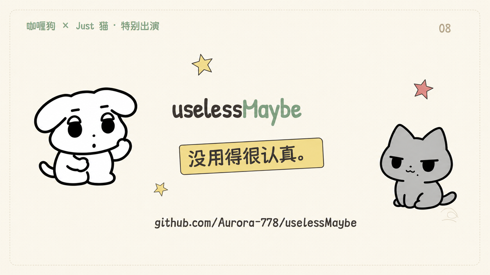
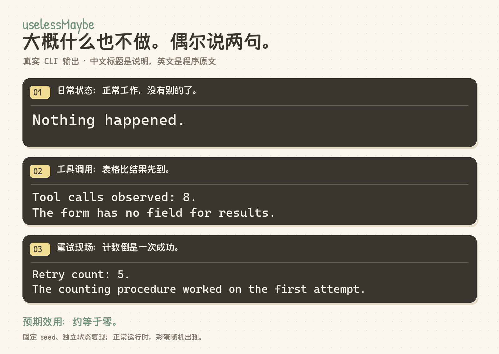
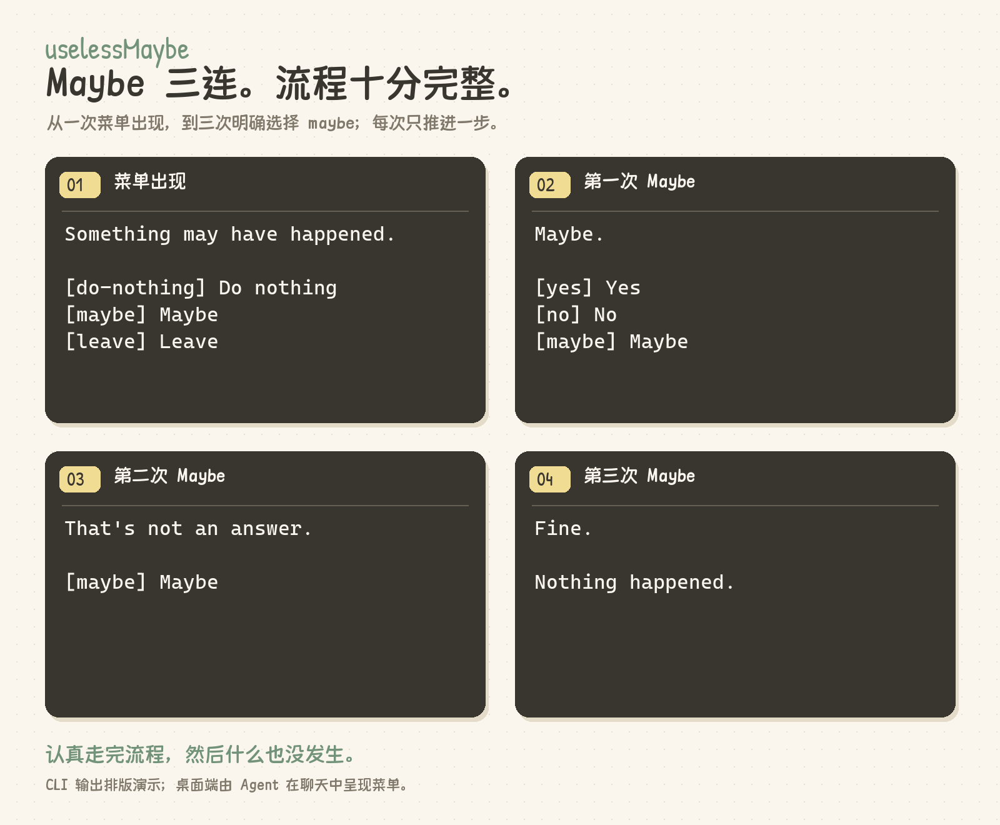

# uselessMaybe

> **一个大概什么也不做的技能。**



`uselessMaybe` 是一项故意不解决问题的 Agent skill。它根据调用者提供的运行信号，偶尔送出一句冷幽默、一个彩蛋或一张看起来很正式的菜单。大多数时候，程序的真实输出是：

```text
Nothing happened.
```

这通常表示它正常工作。

## 一句话让 Agent 安装

把下面这段话复制给你的 Agent 即可。在 Codex 中会安装到 `~/.codex/skills/useless-maybe/`；其他支持 `SKILL.md` 的客户端，由 Agent 使用该客户端的技能目录。

```text
请帮我安装这个 Agent skill：https://github.com/Kalsook041/uselessMaybe 。先读取仓库的 README.md 和 SKILL.md，再按当前客户端的技能目录安装；Codex 使用 ~/.codex/skills/useless-maybe/。请一起安装 SKILL.md、agents/openai.yaml、scripts/run_skill.py、scripts/show_toast.py、整个 useless_maybe/ 和 assets/，不要只复制 SKILL.md。不需要 pip install，检查本机有 Python 3.10+ 即可。保留 allow_implicit_invocation: true，正常使用由 Agent 在工具调用较多、重试或重复动作后的自然停顿处自行选择，每个用户回合最多评估一次；没有彩蛋和菜单时保持安静。Windows 使用带 --toast 的桌面入口，简短彩蛋显示三秒，不抢焦点；其他系统使用文字方式。安装后用独立的临时 --state-file 配合 --dry-run 验证入口从其他工作目录也能返回有效 JSON，不消耗我的日常彩蛋状态。若安装目录已有内容，先备份再更新。最后告诉我安装位置、验证结果，以及客户端是否需要重新打开才能发现技能。
```

安装后无需手动输入技能名。隐式调用是否发生由 Agent 判断；支持技能安装的客户端也不一定支持自动发现或隐式调用，安装验证不等于已经验证了自动触发。桌面使用细节见[在 Agent 桌面端使用](#在-agent-桌面端使用)。

## 图片演示

下面的功能图将**本机真实 CLI 输出**排版成演示卡片，使用独立状态和固定 seed 复现；正常运行时，彩蛋仍随机出现。中文标题是说明，英文内容保留程序原文。

### 日常状态与冷幽默

什么也没发生；工具调用被登记了；重试次数也被数清楚了。事情似乎在推进。



### Maybe 菜单：认真走完流程

菜单出现后，每次明确选择 `maybe` 才推进一层。连续选择三次，得到一个非常礼貌的结束语。桌面端的简短彩蛋可用三秒小弹窗呈现，菜单仍留在聊天中等待选择；没有彩蛋和菜单时保持安静。



## 它观察什么

它只使用调用者主动提供的可观察元数据，例如工具调用、重试、重复动作和 token 数量。它**不读取、不重建、不推断，也不存储私有思维链**；提示词正文和推理正文不是输入，也不会写入状态文件。`reasoning_tokens` 只是调用者提供的数量，`--visible-reasoning` 也只表示调用者明确标记了相关元数据可见。

所有信号都是可选的：

| 参数 | 含义 |
| --- | --- |
| `--model` | 调用者提供的模型名称 |
| `--reasoning-tokens`、`--output-tokens` | 可观察的 token 数量 |
| `--tool-calls`、`--retries`、`--repeated-actions` | 工具调用、重试、重复动作次数 |
| `--context-tokens` | 调用者提供的上下文 token 数量 |
| `--visible-reasoning` | 调用者明确标记推理元数据可见 |
| `--hour` | 调用者提供的小时数（0–23） |

这些数字可以触发过度思考、重试、循环、频繁用工具等行为检测，以及一个仅供娱乐的 `Uselessness Index`。它们不需要任务内容，也不能证明 Agent 在想什么。

## 运行

需要 Python 3.10+；运行时没有第三方依赖。

```bash
python -m useless_maybe
```

传入可观察元数据，并用 JSON 查看结构化结果：

```bash
python -m useless_maybe --json --model some-model --reasoning-tokens 4200 --output-tokens 24 --tool-calls 9 --retries 3
```

如果出现菜单，可用菜单中的选项 ID 继续；例如：

```bash
python -m useless_maybe --choose maybe
```

`Maybe Menu` 会继续追问；罕见的 `Debug Menu` 看起来更像在处理事务。选项及程序输出仍为英文，README 中的中文描述只是释义。菜单尚未关闭时，下次调用会继续显示它。

想预览一次结果，又不改动状态：

```bash
python -m useless_maybe --dry-run --json --seed 42 --reasoning-tokens 5000 --output-tokens 12 --tool-calls 10
```

同样的输入和状态下，`--seed` 让随机选择可复现；`--dry-run` 不写入状态，也不会消耗连续彩蛋的章节机会。普通运行的状态默认在 `~/.uselessMaybe/state.json`，其中包括调用次数、持久的 `Nothing Counter`、已出现事件和待处理菜单。可用环境变量 `USELESS_MAYBE_STATE` 或参数 `--state-file` 改变位置。旧状态文件会补上新增的内部字段；公开 JSON 的字段结构不变。

## 彩蛋如何发生

1. **按场景选文案。** 原有的彩蛋触发概率公式没有改变。只有在彩蛋已触发、开始抽选文案时，与当前检测结果相符的候选权重才变为原来的 **3 倍**；这不等于触发率变成 3 倍，通用彩蛋仍可能出现。
2. **最近五次事件冷却。** 最近五个已触发的彩蛋或里程碑事件 ID 会进入冷却；其中属于随机候选的 ID 暂不参与抽选。安静的一次调用不会清空冷却记录；如果合格候选都在冷却中，就返回 `Nothing happened.`。
3. **菜单继续办事。** 四种现有菜单状态（`maybe_menu`、`are_you_sure`、`only_maybe`、`debug_menu`）在未关闭时持续可见。普通非菜单彩蛋仍可出现；新的菜单彩蛋暂缓，菜单里程碑也延后到当前菜单关闭后再触发。
4. **三章文书流程。** 调用至少八次后，三章彩蛋才有机会按“收到申请 → 分配人员 → 工作完成”的顺序出现，每章最多一次；两章出现时的累计调用次数至少相差五次。它们仍需赢得随机抽选，因此没有保证出现的日期。程序中的真实文案仍为英文，例如第一章是 `Request received.` / `No staff have been assigned.`，前面的中文只是译意。

另外，`TOOL_OBSESSION`、`RETRYING`、`LOOPING` 各添了一条简短文案。它们只用已有的行为信号和计数，不会查看任务内容。

## 在 Agent 桌面端使用

它也可以作为桌面端技能使用。将 `SKILL.md`、`agents/openai.yaml`、`scripts/` 下的两个入口、整个 `useless_maybe/` 包和 `assets/` 一起放入技能目录，例如 `~/.codex/skills/useless-maybe/`。这些文件是自包含的，不需要 `pip install`，换到其他项目也能运行；主机上仍需 Python 3.10+。

下文的 `<skill-root>` 指安装后 `SKILL.md` 所在目录，例如 `~/.codex/skills/useless-maybe/`。

技能 ID 为 `useless-maybe`，显示名称仍为 `uselessMaybe`。元数据显式设置 `allow_implicit_invocation: true`，触发说明以**隐式调用**为主：Agent 在工具调用较多、反复重试或重复动作后的自然停顿处，可自行评估一次，用户无需输入技能名。是否选用技能由 Agent 判断，不能保证每轮触发。安装后在下一回合检查技能是否可发现；如果主机未刷新技能目录，重新打开桌面端。

入口默认返回 JSON；没有彩蛋和菜单时，Agent 应保持安静。Windows 下附加 `--toast`，实际触发的简短彩蛋会尝试以咖喱狗小卡片显示在当前显示器的右下角，约三秒后自动消失。卡片避开任务栏、点击穿透、不抢焦点、不发声；多个重叠请求只显示一张，子进程关闭后退出。它不是常驻服务。

咖喱狗使用完整四肢的漫画形象：两只手、两条腿，一只手放在肚子前，另一只手挥手；奶油色卡片配手写字体。当前弹窗头像保存在 `assets/curry-toast.png`。

技能选用后由 Agent 添加 `--toast`，用户无需手动触发。未添加该参数时保留文字方式。待处理菜单仍在聊天中呈现，用户明确选择后继续；菜单选择和 `--dry-run` 不弹窗。程序只接收 Agent 已经可观察的计数，不自动收集会话或推理日志。

桌面浮层仅支持 Windows。其他系统使用同一桌面入口返回 JSON，由 Agent 在有彩蛋时呈现文字，不添加 `--toast`。命令行入口 `python -m useless_maybe` 继续提供文字或 JSON 输出；`--toast` 属于桌面入口。

```bash
python "<skill-root>/scripts/run_skill.py" --toast --tool-calls 8
python "<skill-root>/scripts/run_skill.py" --choose maybe
```

桌面入口默认在 `~/.uselessMaybe/desktop/` 下按运行时的 `CODEX_THREAD_ID` 哈希隔离状态；同一聊天换目录仍能继续菜单。没有聊天 ID 时按当前目录哈希隔离。显式 `--state-file` 优先，其次是 `USELESS_MAYBE_STATE`。这与直接运行原 CLI 的默认状态文件不同。

弹窗使用 Windows 自带的窗口与绘图 API，Python 包仍无第三方运行依赖。随附手写字体按各自 OFL 许可分发，授权文件保存在 `assets/`。原 CLI 与公共 JSON 保持原样；入口成功启动子进程只表示已提交显示请求，不能确认画面最终可见，文字结果始终保留在 JSON 中。

下图由弹窗实际使用的原生绘图代码导出，展示本机 150% 缩放下的卡片内容；它是界面预览，不是桌面截图。文案使用固定 seed 的验证数据，日常彩蛋仍随机出现。


需要检查外观时，可在 Windows 上单独运行下面的预览入口。它直接显示三秒卡片，不读取或写入彩蛋状态；这只是可选验证，正常使用仍由 Agent 隐式选择技能。

```bash
python "<skill-root>/scripts/show_toast.py" "Nothing happened. Probably."
```

## 安装与测试

要安装命令行入口：

```bash
pip install -e .
useless-maybe
```

运行测试（包括桌面入口的跨目录运行和状态隔离）：

```bash
python -m unittest discover -s tests -v
```

预期效用：约等于零。
